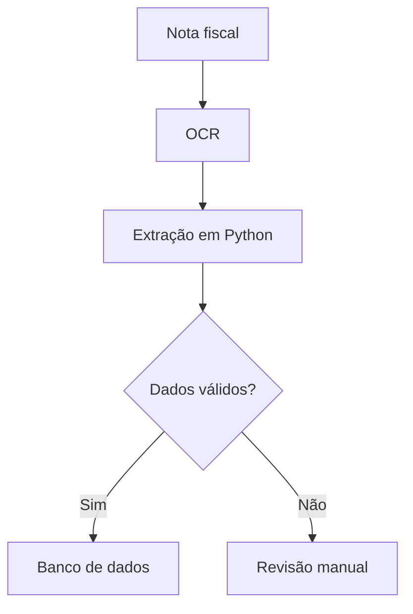
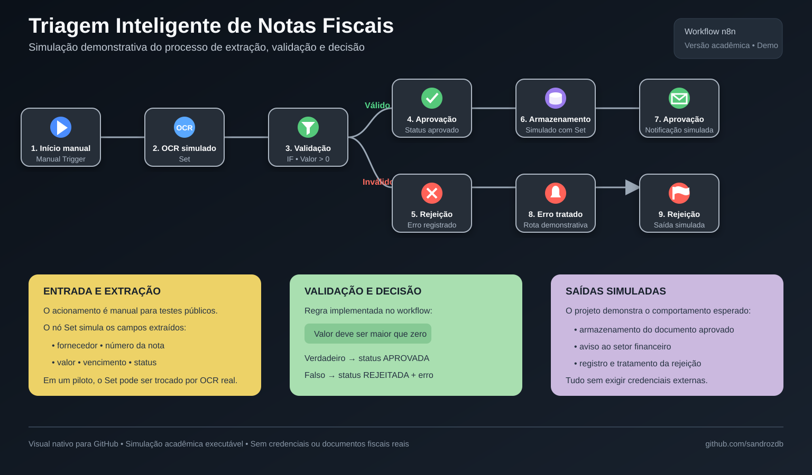

<p align="center"></p>

# Automação de Triagem de Notas Fiscais com n8n e OCR

Solução acadêmica que transforma a conferência manual de documentos fiscais em um pipeline automatizado de entrada, leitura, extração, validação e armazenamento.

## Problema

A conferência manual de notas fiscais consome tempo, aumenta o risco de erros de digitação e dificulta a rastreabilidade quando o volume de documentos cresce.

## Solução

O projeto combina:

- **n8n** para orquestrar o workflow;
- **OCR** para converter documentos em texto;
- **Python** para extrair, tratar e validar os campos;
- **SQL/MySQL** para persistência estruturada;
- **GitHub Actions** para validar o código automaticamente.



## Visão demonstrativa do workflow



> Esta imagem é uma **representação conceitual** do processo. No workflow importável atual, o OCR, o armazenamento e as notificações são simulados com nós `Set`, permitindo testar publicamente a lógica sem credenciais ou serviços externos.

| Parte do fluxo | Estado atual |
|---|---|
| Entrada | Acionamento manual |
| OCR | Dados fiscais simulados |
| Validação | Regra funcional: valor maior que zero |
| Decisão | Rotas de aprovação e rejeição |
| Banco de dados | Resposta simulada |
| Notificações | Resposta simulada |
| Produção | Preparado para integrar OCR, banco e e-mail reais |

A arte detalha o comportamento planejado de ponta a ponta. O JSON exportado contém **7 nós funcionais e 4 notas visuais**; por isso, ela não deve ser interpretada como captura literal da tela do n8n.

## Dados processados

- número e data da nota;
- fornecedor e CNPJ;
- valor total;
- descrição dos itens;
- categoria e status do documento.

## Diferenciais

- workflow n8n disponível em `workflow/fluxo-n8n.json`;
- módulos Python separados por responsabilidade;
- execução demonstrável com OCR, persistência e notificações simulados;
- credenciais e arquivos `.env` protegidos;
- estrutura preparada para integração com e-mail, ERP e dashboards.

## Indicadores para um piloto

| Indicador | Decisão apoiada |
|---|---|
| Tempo médio por documento | Medir produtividade |
| Taxa de extração automática | Avaliar eficiência do OCR |
| Percentual de revisão manual | Identificar gargalos |
| Taxa de erros por campo | Medir confiabilidade |
| Volume processado | Avaliar capacidade |

> O projeto não declara ganhos numéricos sem medição real.

## Como executar

```bash
python -m venv .venv

# Windows
.venv\Scripts\activate

pip install -r requirements.txt
python src/main.py
```

Nesta simulação demonstrativa, a leitura OCR e a persistência são representadas por dados fictícios e respostas controladas. Para evoluir o protótipo para uma integração real, instale o Tesseract OCR e configure localmente:

```env
DB_HOST=
DB_PORT=
DB_USER=
DB_PASSWORD=
DB_NAME=
```

## Importar o workflow no n8n

1. Abra o n8n.
2. Selecione **Import from File**.
3. Escolha `workflow/fluxo-n8n.json`.
4. Execute o gatilho manual.
5. Confira os dados extraídos e o status de validação.

O workflow não contém credenciais.

## Estrutura

```text
├── src/                  # processamento em Python
├── workflow/             # workflow importável do n8n
├── database/             # estrutura SQL
├── examples/             # arquivos de demonstração
├── assets/               # capa e visão conceitual do fluxo
├── requirements.txt
└── README.md
```

## Segurança e qualidade

- senhas, chaves e documentos reais não são versionados;
- o GitHub Actions valida a sintaxe e executa a demonstração;
- documentos fiscais usados em testes devem ser fictícios ou anonimizados.

## Próximos passos

- substituir as simulações por OCR, banco e notificações reais;
- adicionar uma captura da execução real no n8n;
- validar CNPJ automaticamente;
- integrar com e-mail e ERP;
- criar dashboard operacional;
- medir os indicadores em um piloto controlado.

## Autor

**Sandro Ferreira** — estudante de Engenharia da Computação e de Inteligência Artificial e Automação Digital.

[LinkedIn](https://linkedin.com/in/sandrozdb) · [GitHub](https://github.com/sandrozdb)
